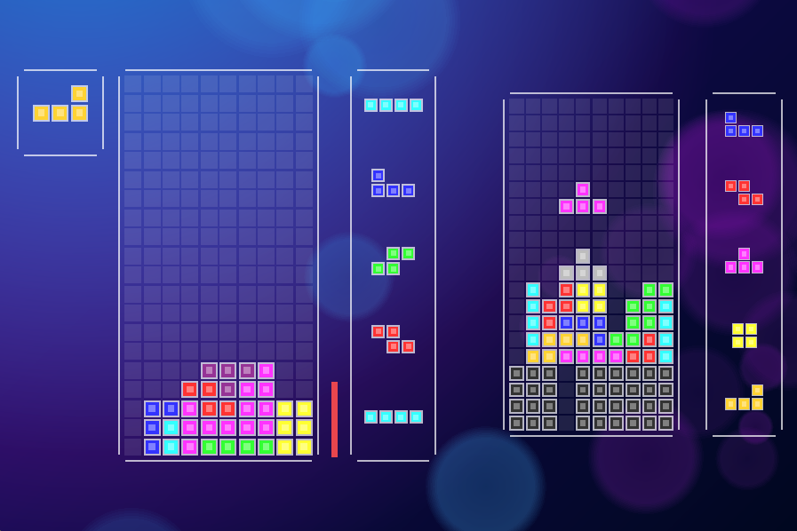

TetrisLive
=============


Features
---------
- Live multiplayer Tetris in Java and OpenGL
- Battle with up to 9 friends.
- Tetris AI guide (depth-first search simulation algorithm)

General Use
-----------
Build on Mac OS X. Scripts can be adapted for Windows. LWJGL libraries not included for linux.

Run ```./build.sh``` to build

Use ```./run.sh``` to run

Use ```./server.sh``` to host the multiplayer server


Gameplay
-----------

Arrow keys - to move pieces

Shift - hold piece

Space - to drop
